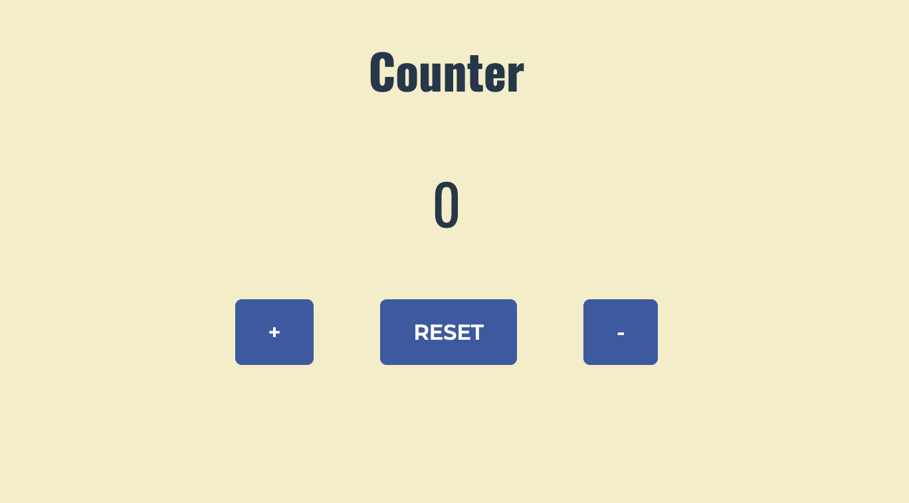

# Counter Project

## Overview

This is a simple counter application built with React. The application allows users to increment, decrement, and reset a counter value. It's an excellent project for understanding basic React concepts such as state management and event handling.

## Features

- Increment Counter: Increases the counter value by 1.
- Decrement Counter: Decreases the counter value by 1.
- Reset Counter: Resets the counter value to 0.
- Display Counter: Shows the current counter value.

## Installation

### Clone the repository

`git clone https://github.com/yourusername/counter-project.git`

### Install dependencies

`npm install`

### Run the application

`npm run dev`

